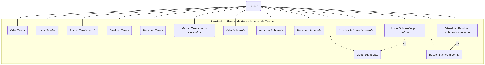
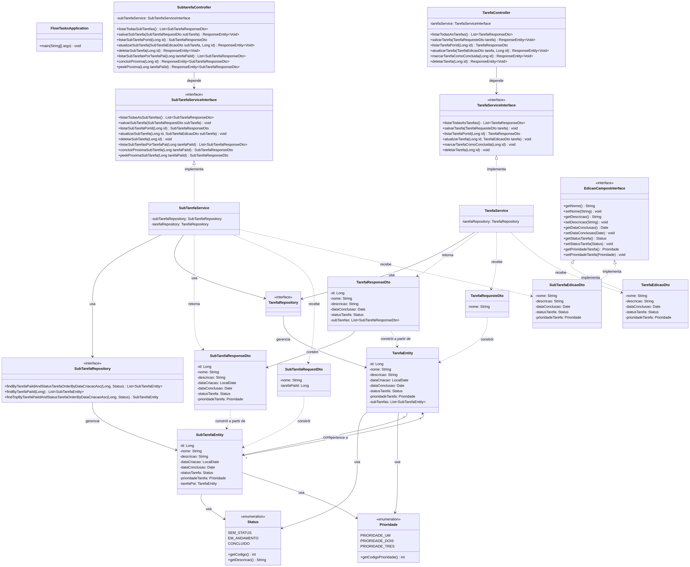

<div align="center">
    <h1>FlowTasks</h1>
    <h3><i>API RESTful para Gerenciamento e Organização de Tarefas</i></h3>

   
   
   

</div>

## 📜 Descrição

O **FlowTasks** é uma aplicação backend desenvolvida em Java com o ecossistema Spring Boot, projetada para o gerenciamento e organização de tarefas e subtarefas. A aplicação expõe uma API RESTful que permite criar, listar, atualizar e remover tarefas, bem como gerenciar subtarefas associadas a cada tarefa principal.

Diferencia-se por implementar um mecanismo de **fila (FIFO)** para o processamento sequencial de subtarefas, permitindo que as atividades sejam concluídas na ordem em que foram criadas, com suporte a inspeção da próxima tarefa pendente sem consumi-la.

## 📌 Funcionalidades

- **Gerenciamento de Tarefas**: CRUD completo de tarefas (criar, listar, buscar por ID, atualizar e remover).
- **Gerenciamento de Subtarefas**: CRUD completo de subtarefas vinculadas a uma tarefa pai.
- **Marcação de Conclusão**: Endpoint dedicado para marcar tarefas como concluídas.
- **Fila de Processamento**: Conclusão sequencial de subtarefas na ordem de criação (FIFO) via `Queue`/`LinkedList`.
- **Inspeção de Fila**: Visualização da próxima subtarefa pendente sem removê-la do processamento.
- **Filtragem**: Listagem de subtarefas por tarefa pai.
- **Perfis de Ambiente**: Suporte a perfis `test` (H2 em memória) e `dev` (PostgreSQL).
- **Dados de Seed**: Script `data.sql` com dados iniciais para desenvolvimento.

## 🧰 Stack de Tecnologias

### Back-End
- **Java 21** — Linguagem de programação.
- **Spring Boot 3.5.11** — Framework para criação de aplicações Java.
- **Spring Web** — Construção de APIs RESTful (controladores, mapeamento HTTP).
- **Spring Data JPA** — Camada de persistência e mapeamento objeto-relacional.
- **Hibernate** — Implementação de JPA para ORM.

### Banco de Dados
- **PostgreSQL** — Banco de dados relacional para o ambiente de desenvolvimento (`application-dev.properties`).
- **H2 Database** — Banco de dados em memória para o ambiente de testes (`application-test.properties`).

### Ferramentas e Build
- **Maven** — Gerenciamento de dependências e build (via `pom.xml` e wrapper `mvnw`).
- **Spring Boot DevTools** — Ferramenta de desenvolvimento com reinicialização automática.

### Testes
- **Spring Boot Starter Test** — Suporte a testes automatizados (JUnit, etc.).

## 🏗️ Arquitetura

O projeto segue o padrão de **arquitetura em camadas** (Layered Architecture), com separação clara de responsabilidades:

```
Controller (REST) → Service (Regras de Negócio) → Repository (Acesso a Dados) → Entity (Domínio)
```

- **Controller**: Expõe os endpoints REST e recebe as requisições HTTP.
- **Service**: Contém a lógica de negócio e orquestra as operações.
- **Repository**: Abstrai o acesso ao banco de dados via Spring Data JPA.
- **Entity**: Representa as tabelas do banco de dados (JPA/Hibernate).
- **DTO**: Objetos de transferência de dados para desacoplar a API das entidades internas.
- **Enums**: Tipos enumerados para `Status` e `Prioridade`.

## 🎲 Modelo de Dados

### Entidades

| Entidade | Tabela | Descrição |
|----------|--------|-----------|
| `TarefaEntity` | `tb_tarefas` | Tarefa principal com nome, descrição, status, prioridade e data de criação/conclusão. |
| `SubTarefaEntity` | `tb_sub_tarefas` | Subtarefa vinculada a uma tarefa pai, com os mesmos atributos de estado. |

### Relacionamento

- **Tarefa 1 ── * Subtarefa**: Relacionamento `@OneToMany` / `@ManyToOne` com chave estrangeira `tarefa_pai_id`.
- **Exclusão em Cascata**: Ao remover uma tarefa, suas subtarefas são removidas automaticamente (`CascadeType.REMOVE`).

### Enums

- `Status`: `SEM_STATUS` (1), `EM_ANDAMENTO` (2), `CONCLUIDO` (3).
- `Prioridade`: `PRIORIDADE_UM` (1), `PRIORIDADE_DOIS` (2), `PRIORIDADE_TRES` (3).

## 💻 Como Executar

### Pré-requisitos
- Java 21 instalado.
- Maven (ou utilizar o wrapper `mvnw` incluso).
- PostgreSQL (opcional, para o perfil `dev`).

### Passos

1. Clone o repositório:
   ```bash
   git clone https://github.com/leticia2025IFRN/flowTasks.git
   cd flowTasks
   ```

2. Execute a aplicação (perfil `test` é o padrão, utilizando H2 em memória):
   ```bash
   ./mvnw spring-boot:run
   ```

3. Para utilizar o perfil `dev` (PostgreSQL), defina a variável de ambiente:
   ```bash
   APP_PROFILE=dev ./mvnw spring-boot:run
   ```

4. Acesse a API em `http://localhost:8080`.

5. (Opcional) Console H2 disponível em `http://localhost:8080/h2-console` no perfil `test`.

## 📍 Endpoints da API

### Tarefas (`/tarefas`)
| Método | Endpoint | Descrição |
|--------|----------|-----------|
| GET | `/tarefas` | Lista todas as tarefas. |
| POST | `/tarefas` | Cria uma nova tarefa. |
| GET | `/tarefas/{id}` | Busca tarefa por ID. |
| PATCH | `/tarefas/{id}/atualizar` | Atualiza os dados da tarefa. |
| PATCH | `/tarefas/{id}/concluir` | Marca a tarefa como concluída. |
| DELETE | `/tarefas/{id}` | Remove a tarefa. |

### Subtarefas (`/subtarefas`)
| Método | Endpoint | Descrição |
|--------|----------|-----------|
| GET | `/subtarefas` | Lista todas as subtarefas. |
| POST | `/subtarefas` | Cria uma nova subtarefa. |
| GET | `/subtarefas/{id}` | Busca subtarefa por ID. |
| PATCH | `/subtarefas/{id}/atualizar` | Atualiza os dados da subtarefa. |
| DELETE | `/subtarefas/{id}` | Remove a subtarefa. |
| GET | `/subtarefas/tarefa/{tarefaPaiId}` | Lista subtarefas de uma tarefa pai. |
| PATCH | `/subtarefas/{id}/concluir-proxima` | Conclui a próxima subtarefa da fila (FIFO). |
| GET | `/subtarefas/{tarefaPaiId}/proxima` | Visualiza a próxima subtarefa pendente. |

## 🌳 Composição dos Diretórios

```
./flowTasks
├── mvnw
├── mvnw.cmd
├── pom.xml
├── README.md
└── src
    ├── main
    │   ├── java
    │   │   └── br
    │   │       └── com
    │   │           └── flowtasks
    │   │               ├── controller
    │   │               │   ├── SubtarefaController.java
    │   │               │   └── TarefaController.java
    │   │               ├── dto
    │   │               │   ├── SubTarefaEdicaoDto.java
    │   │               │   ├── SubTarefaRequestDto.java
    │   │               │   ├── SubTarefaResponseDto.java
    │   │               │   ├── TarefaEdicaoDto.java
    │   │               │   ├── TarefaRequesteDto.java
    │   │               │   └── TarefaResponseDto.java
    │   │               ├── entities
    │   │               │   ├── SubTarefaEntity.java
    │   │               │   └── TarefaEntity.java
    │   │               ├── enums
    │   │               │   ├── Prioridade.java
    │   │               │   └── Status.java
    │   │               ├── FlowTasksApplication.java
    │   │               ├── repository
    │   │               │   ├── SubTarefaRepository.java
    │   │               │   └── TarefaRepository.java
    │   │               └── service
    │   │                   ├── SubTarefaService.java
    │   │                   └── TarefaService.java
    │   └── resources
    │       ├── application-dev.properties
    │       ├── application.properties
    │       ├── application-test.properties
    │       └── data.sql
    └── test
        └── java
            └── br
                └── com
                    └── flowtasks
                        └── FlowTasksApplicationTests.java
```

## Diagramas do projeto

### Diagrama de Casos de Uso



### Diagrama de Classes



## 🤝 Contribuição

Contribuições são bem-vindas! Para contribuir:

1. Faça um fork do projeto.
2. Crie uma branch para sua feature (`git checkout -b feature/nova-feature`).
3. Commit suas mudanças (`git commit -m 'Adiciona nova feature'`).
4. Push para a branch (`git push origin feature/nova-feature`).
5. Abra um Pull Request.

## 📝 Licença

Este projeto está sob a licença MIT. Consulte o arquivo LICENSE para mais detalhes.
