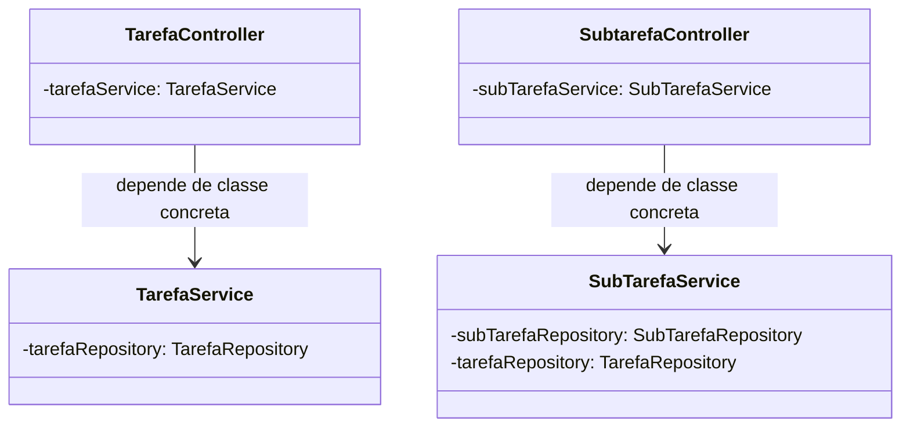
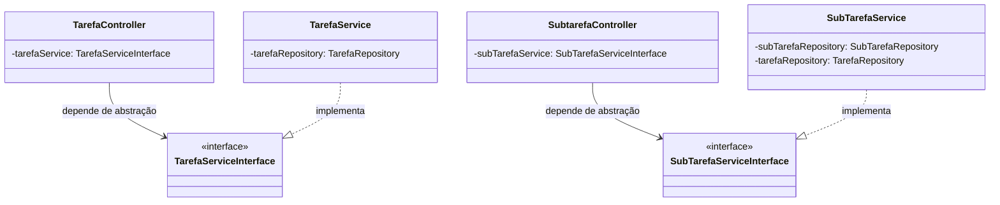
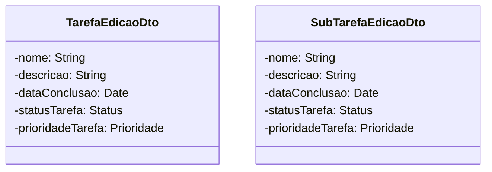
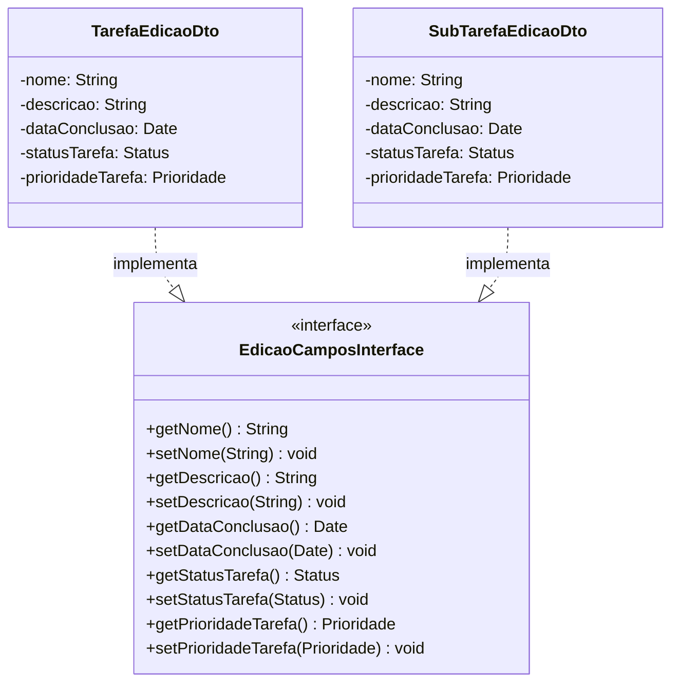

# Correções SOLID — FlowTasks

## Análise Geral

| Princípio | Status | Violação |
|-----------|--------|----------|
| **S** — Single Responsibility | ✅ OK | Responsabilidades bem separadas entre camadas (Controller, Service, Repository, Entity) |
| **O** — Open/Closed | ❌ Corrigido | Services eram classes concretas sem interfaces — impediam extensão sem modificação |
| **L** — Liskov Substitution | ✅ OK | Sem hierarquias de herança problemáticas no projeto |
| **I** — Interface Segregation | ⚠️ Melhorado | DTOs de edição duplicados; services segregados por interfaces |
| **D** — Dependency Inversion | ❌ Corrigido | Controllers dependiam de classes concretas, não de abstrações |

---

## 1. Open/Closed Principle (OCP) + Dependency Inversion Principle (DIP)

### Violação

As classes `TarefaService` e `SubTarefaService` eram classes concretas sem interfaces. Os controllers dependiam diretamente dessas implementações, violando:
- **OCP**: Para adicionar uma nova estratégia de serviço, seria necessário modificar os controllers
- **DIP**: Módulos de alto nível (controllers) dependiam de módulos de baixo nível (services concretos)

#### Código Violado

**TarefaController.java** (antes):
```java
import br.com.flowtasks.service.TarefaService;

@RestController
@RequestMapping(value = "/tarefas")
public class TarefaController {

    @Autowired
    private TarefaService tarefaService;
    // ...
}
```

**SubtarefaController.java** (antes):
```java
import br.com.flowtasks.service.SubTarefaService;

@RestController
@RequestMapping(value = "/subtarefas")
public class SubtarefaController {

    @Autowired
    private SubTarefaService subTarefaService;
    // ...
}
```

**TarefaService.java** (antes):
```java
@Service
public class TarefaService {
    @Autowired
    private TarefaRepository tarefaRepository;
    // ...
}
```

**SubTarefaService.java** (antes):
```java
@Service
public class SubTarefaService {
    @Autowired
    private SubTarefaRepository subTarefaRepository;
    @Autowired
    private TarefaRepository tarefaRepository;
    // ...
}
```

#### Diagrama de Classes (Antes)



---

### Correção

Foram criadas interfaces para os serviços, e os controllers passaram a depender delas.

#### Código Corrigido

**TarefaServiceInterface.java** (novo):
```java
package br.com.flowtasks.service;

import br.com.flowtasks.dto.TarefaEdicaoDto;
import br.com.flowtasks.dto.TarefaRequesteDto;
import br.com.flowtasks.dto.TarefaResponseDto;
import java.util.List;

public interface TarefaServiceInterface {
    List<TarefaResponseDto> listarTodasAsTarefas();
    void salvarTarefa(TarefaRequesteDto tarefa);
    void deletarTarefa(Long id);
    void atualizarTarefa(Long id, TarefaEdicaoDto tarefa);
    TarefaResponseDto listarTarefaPorId(Long id);
    void marcarTarefaComoConcluida(Long id);
}
```

**SubTarefaServiceInterface.java** (novo):
```java
package br.com.flowtasks.service;

import br.com.flowtasks.dto.SubTarefaEdicaoDto;
import br.com.flowtasks.dto.SubTarefaRequestDto;
import br.com.flowtasks.dto.SubTarefaResponseDto;
import java.util.List;

public interface SubTarefaServiceInterface {
    List<SubTarefaResponseDto> listarTodasAsSubTarefas();
    void salvarSubTarefa(SubTarefaRequestDto subTarefa);
    void deletarSubTarefa(Long id);
    void atualizarSubTarefa(Long id, SubTarefaEdicaoDto subTarefa);
    SubTarefaResponseDto listarSubTarefaPorId(Long id);
    List<SubTarefaResponseDto> listarSubTarefasPorTarefaPai(Long tarefaPaiId);
    SubTarefaResponseDto concluirProximaSubTarefa(Long tarefaPaiId);
    SubTarefaResponseDto peekProximaSubTarefa(Long tarefaPaiId);
}
```

**TarefaService.java** (modificado):
```java
@Service
public class TarefaService implements TarefaServiceInterface {
    @Autowired
    private TarefaRepository tarefaRepository;
    // ... métodos inalterados
}
```

**SubTarefaService.java** (modificado):
```java
@Service
public class SubTarefaService implements SubTarefaServiceInterface {
    @Autowired
    private SubTarefaRepository subTarefaRepository;
    @Autowired
    private TarefaRepository tarefaRepository;
    // ... métodos inalterados
}
```

**TarefaController.java** (modificado):
```java
import br.com.flowtasks.service.TarefaServiceInterface;

@RestController
@RequestMapping(value = "/tarefas")
public class TarefaController {

    @Autowired
    private TarefaServiceInterface tarefaService;
    // ... métodos inalterados
}
```

**SubtarefaController.java** (modificado):
```java
import br.com.flowtasks.service.SubTarefaServiceInterface;

@RestController
@RequestMapping(value = "/subtarefas")
public class SubtarefaController {

    @Autowired
    private SubTarefaServiceInterface subTarefaService;
    // ... métodos inalterados
}
```

#### Diagrama de Classes (Depois)



---

## 2. Interface Segregation Principle (ISP)

### Violação

As classes `TarefaEdicaoDto` e `SubTarefaEdicaoDto` possuem exatamente os mesmos campos (nome, descricao, dataConclusao, statusTarefa, prioridadeTarefa). Isso representa duplicação de código e uma violação do ISP: se um cliente precisa apenas de parte desses campos, ainda assim depende da interface completa.

#### Código Violado

**TarefaEdicaoDto.java**:
```java
public class TarefaEdicaoDto {
    private String nome;
    private String descricao;
    private Date dataConclusao;
    private Status statusTarefa;
    private Prioridade prioridadeTarefa;
    // getters e setters para todos os campos
}
```

**SubTarefaEdicaoDto.java**:
```java
public class SubTarefaEdicaoDto {
    private String nome;
    private String descricao;
    private Date dataConclusao;
    private Status statusTarefa;
    private Prioridade prioridadeTarefa;
    // getters e setters para todos os campos
}
```

#### Diagrama de Classes (Antes)



---

### Correção

Foi criada uma interface `EdicaoCamposInterface` que define o contrato comum, e ambas as DTOs a implementam. Isso permite que clientes dependam da abstração enxuta em vez das classes concretas completas.

#### Código Corrigido

**EdicaoCamposInterface.java** (novo):
```java
package br.com.flowtasks.dto;

import br.com.flowtasks.enums.Prioridade;
import br.com.flowtasks.enums.Status;
import java.util.Date;

public interface EdicaoCamposInterface {
    String getNome();
    void setNome(String nome);
    String getDescricao();
    void setDescricao(String descricao);
    Date getDataConclusao();
    void setDataConclusao(Date dataConclusao);
    Status getStatusTarefa();
    void setStatusTarefa(Status statusTarefa);
    Prioridade getPrioridadeTarefa();
    void setPrioridadeTarefa(Prioridade prioridadeTarefa);
}
```

**TarefaEdicaoDto.java** (modificado):
```java
public class TarefaEdicaoDto implements EdicaoCamposInterface {
    private String nome;
    private String descricao;
    private Date dataConclusao;
    private Status statusTarefa;
    private Prioridade prioridadeTarefa;
    // getters e setters inalterados
}
```

**SubTarefaEdicaoDto.java** (modificado):
```java
public class SubTarefaEdicaoDto implements EdicaoCamposInterface {
    private String nome;
    private String descricao;
    private Date dataConclusao;
    private Status statusTarefa;
    private Prioridade prioridadeTarefa;
    // getters e setters inalterados
}
```

#### Diagrama de Classes (Depois)



---

## 3. Single Responsibility Principle (SRP)

### Análise

O projeto já segue o SRP corretamente:

| Classe | Responsabilidade Única |
|--------|----------------------|
| `TarefaController` | Gerenciar requisições HTTP de tarefas |
| `SubtarefaController` | Gerenciar requisições HTTP de subtarefas |
| `TarefaService` | Regras de negócio de tarefas |
| `SubTarefaService` | Regras de negócio de subtarefas + fila FIFO |
| `TarefaRepository` | Acesso a dados de tarefas |
| `SubTarefaRepository` | Acesso a dados de subtarefas |
| `TarefaEntity` | Modelo de domínio de tarefa |
| `SubTarefaEntity` | Modelo de domínio de subtarefa |
| DTOs | Transferência de dados entre camadas |
| Enums | Definição de constantes (Status, Prioridade) |

**Nenhuma correção necessária.**

---

## 4. Liskov Substitution Principle (LSP)

### Análise

O projeto não possui hierarquias de herança significativas além da interface `JpaRepository` do Spring Data JPA, que é utilizada corretamente pelos repositórios:

```java
public interface TarefaRepository extends JpaRepository<TarefaEntity, Long> { }
public interface SubTarefaRepository extends JpaRepository<SubTarefaEntity, Long> { }
```

Cada repositório especializa corretamente o comportamento genérico do `JpaRepository` sem violar expectativas.

**Nenhuma correção necessária.**

---

## Resumo das Intervenções

### Arquivos Criados

| Arquivo | Localização | Finalidade |
|---------|------------|------------|
| `TarefaServiceInterface.java` | `src/main/java/br/com/flowtasks/service/` | Interface para service de tarefas (OCP + DIP) |
| `SubTarefaServiceInterface.java` | `src/main/java/br/com/flowtasks/service/` | Interface para service de subtarefas (OCP + DIP) |
| `EdicaoCamposInterface.java` | `src/main/java/br/com/flowtasks/dto/` | Interface comum para DTOs de edição (ISP) |

### Arquivos Modificados

| Arquivo | Alteração |
|---------|-----------|
| `TarefaService.java` | Adicionado `implements TarefaServiceInterface` |
| `SubTarefaService.java` | Adicionado `implements SubTarefaServiceInterface` |
| `TarefaController.java` | Campo `tarefaService` mudado de `TarefaService` para `TarefaServiceInterface` |
| `SubtarefaController.java` | Campo `subTarefaService` mudado de `SubTarefaService` para `SubTarefaServiceInterface` |
| `TarefaEdicaoDto.java` | Adicionado `implements EdicaoCamposInterface` |
| `SubTarefaEdicaoDto.java` | Adicionado `implements EdicaoCamposInterface` |

## Critérios de aceitação

- [x] Todos os conceitos de SOLID foram contemplados.
- [x] Para todos os conceitos foram apresentados os diagramas de classe antes e depois da solução.
