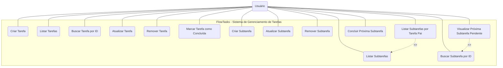

# Diagrama de Casos de Uso — FlowTasks

## Identificação dos Atores

| Ator | Descrição |
|------|-----------|
| **Usuário** | Pessoa que gerencia tarefas e subtarefas por meio da API REST |

## Diagrama

## Descrição dos Casos de Uso

| ID | Caso de Uso | Descrição | Endpoint |
|----|------------|-----------|----------|
| UC01 | Criar Tarefa | Cria uma nova tarefa | `POST /tarefas` |
| UC02 | Listar Tarefas | Lista todas as tarefas | `GET /tarefas` |
| UC03 | Buscar Tarefa por ID | Retorna uma tarefa pelo seu ID | `GET /tarefas/{id}` |
| UC04 | Atualizar Tarefa | Atualiza os dados de uma tarefa | `PATCH /tarefas/{id}/atualizar` |
| UC05 | Remover Tarefa | Exclui uma tarefa e suas subtarefas em cascata | `DELETE /tarefas/{id}` |
| UC06 | Marcar Tarefa como Concluída | Altera o status da tarefa para CONCLUIDO | `PATCH /tarefas/{id}/concluir` |
| UC07 | Criar Subtarefa | Cria uma nova subtarefa vinculada a uma tarefa pai | `POST /subtarefas` |
| UC08 | Listar Subtarefas | Lista todas as subtarefas | `GET /subtarefas` |
| UC09 | Buscar Subtarefa por ID | Retorna uma subtarefa pelo seu ID | `GET /subtarefas/{id}` |
| UC10 | Atualizar Subtarefa | Atualiza os dados de uma subtarefa | `PATCH /subtarefas/{id}/atualizar` |
| UC11 | Remover Subtarefa | Exclui uma subtarefa | `DELETE /subtarefas/{id}` |
| UC12 | Listar Subtarefas por Tarefa Pai | Lista subtarefas filtradas por tarefa pai | `GET /subtarefas/tarefa/{tarefaPaiId}` |
| UC13 | Concluir Próxima Subtarefa | Conclui a subtarefa mais antiga pendente (FIFO) | `PATCH /subtarefas/{id}/concluir-proxima` |
| UC14 | Visualizar Próxima Subtarefa Pendente | Inspeciona a próxima subtarefa sem concluí-la | `GET /subtarefas/{tarefaPaiId}/proxima` |

## Relacionamentos

| Tipo | Uso | Significado |
|------|-----|-------------|
| `<<extend>>` | UC12 → UC08 | Listagem de subtarefas por tarefa pai é uma variação condicional da listagem geral |
| `<<extend>>` | UC14 → UC09 | Visualização da próxima pendente é um caso específico de busca de subtarefa |

## Critérios de aceitação

- [x] O diagrama possui a fronteira do sistema delimitando o escopo.
- [x] Os atores estão associados corretamente aos casos de uso.
- [x] A semântica da UML (setas de associação, inclusão e extensão) foi aplicada corretamente.
