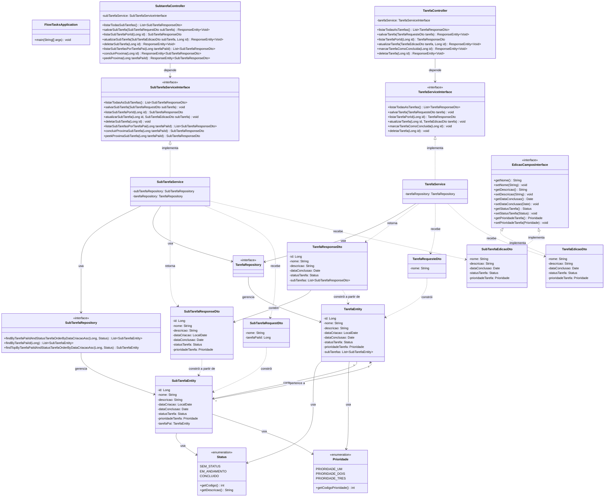

# Diagrama de Classes — FlowTasks

## Diagrama

## Legenda dos Relacionamentos

| Símbolo | Significado |
|---------|------------|
| `-->` | Associação (usa) |
| `..>` | Dependência (cria/retorna/recebe) |
| `<\|..` | Realização/Implementação de interface |
| `"1" --> "*"` | Um para muitos (OneToMany) |
| `"*" --> "1"` | Muitos para um (ManyToOne) |
| `<<interface>>` | Interface |
| `<<enumeration>>` | Tipo enumerado |

## Descrição das Camadas

### Camada de Apresentação (Controller)
- **TarefaController**: Expõe endpoints REST para operações em tarefas
- **SubtarefaController**: Expõe endpoints REST para operações em subtarefas

### Camada de Negócio (Service)
- **TarefaService**: Regras de negócio para tarefas
- **SubTarefaService**: Regras de negócio para subtarefas + lógica de fila FIFO

### Camada de Persistência (Repository)
- **TarefaRepository**: Acesso a dados da entidade `TarefaEntity` via Spring Data JPA
- **SubTarefaRepository**: Acesso a dados da entidade `SubTarefaEntity` + queries customizadas para fila FIFO

### Camada de Domínio (Entity)
- **TarefaEntity**: Representa a tabela `tb_tarefas`
- **SubTarefaEntity**: Representa a tabela `tb_sub_tarefas`

### DTOs
- **Request**: Payloads de entrada para criação/edição
- **Response**: Payloads de saída, desacoplando a API das entidades internas
- **EdicaoCamposInterface**: Interface comum para DTOs de edição, garantindo contrato unificado (ISP) |

### Enums
- **Status**: Estados possíveis (SEM_STATUS, EM_ANDAMENTO, CONCLUIDO)
- **Prioridade**: Níveis de prioridade (1, 2, 3)

## Critérios de aceitação

- [x] O diagrama de classes permite implementar as funcionalidades detalhadas no diagrama de casos de uso.
- [x] O diagrama de classes permite implementar todas as user stories.
- [x] A semântica da UML foi aplicada corretamente.
